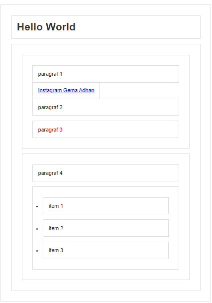

## DOM Events
Event pada javascript merepresentasikan sebuah kejadian yang terjadi di dalam DOM. kejadian tersebut bisa dilakukan oleh user (mouse event, keyboard event, dll). ataupun dilakukan secara otomatis oleh API (animasi selesai dijalankan, halaman selesai di load, dll)

## Cara "Mendengarkan Event
- Event Handler
  - Inline HTML attribute
  - elemen method
- addEventListener() 

### Event Handler
gunakan keyword on diikuti nama event nya 
on(event)
#### Inline HTML
```js
const p3 = document.querySelector(".p3");

function ubahWarna() {
  p3.style.backgroundColor = "lightBlue";
}
```

kemudian panggil kelas nya di elemen yang akan diklik
```html
...
 <p class="p3" onclick="ubahWarna()">paragraf 3</p>
 ...
```

#### Elemen Method
kita panggil method onclick pada elemen yang akan diklik kemudian isi dengan fungsi tanpa tanda kurung
```js
const p2 = document.querySelector(".p2");
p2.onclick = ubahWarna;
```

### addEventListener
sebagai contoh kita akan menambahkan list item baru ketika "paragraph 4" diklik
```js
const p4 = document.querySelector("section#b p");
p4.addEventListener("click", function () {
  const ul = document.querySelector("section#b ul");
  const liBaru = document.createElement("li");
  const teksLiBaru = document.createTextNode("Item baru");
  liBaru.appendChild(teksLiBaru);
  ul.appendChild(liBaru);
});
```

### Perbedaan EventHandler dan addEventListener 

Jika menggunakan eventHandler perubahan yang terakhir dilakukan akan menimpa perubahan sebelumnya, namun jika menggunakan addEventListener perubahan nya akan ditambahkan. 

```js
//Pakai EventHandler
const p3 = document.querySelector(".p3");
p3.onclick = function () {
  p3.style.backgroundColor = "lightblue";
};
p3.onclick = function () {
  p3.style.color = "red";
};
```



```js
//Pakai EventHandler
const p3 = document.querySelector(".p3");
p3.addEventListener("click", function () {
  p3.style.backgroundColor = "lightBlue";
});
p3.addEventListener("click", function () {
  p3.style.color = "red";
});
```


### Daftar Event dikelompokkan berdasarkan beberapa kategori
- mouse event
  - click
  - dblclick
  - mouseover
  - mouseenter
  - mouseup
  - wheel
- keyboard event
  - keydown
  - keypress
  - keyup
- resource event
- focus event
- view event
  - resize
  - scroll
- form event
  - reset
  - submit
- Css Animation dan Transition Event
- Drag and Drop Event
- Dll.

```js
p3.addEventListener("dblclick", function () {
  p3.style.backgroundColor = "lightBlue";
});
p3.addEventListener("mouseenter", function () {
  p3.style.backgroundColor = "lightBlue";
});
p3.addEventListener("mouseleave", function () {
  p3.style.backgroundColor = "";
});

```

