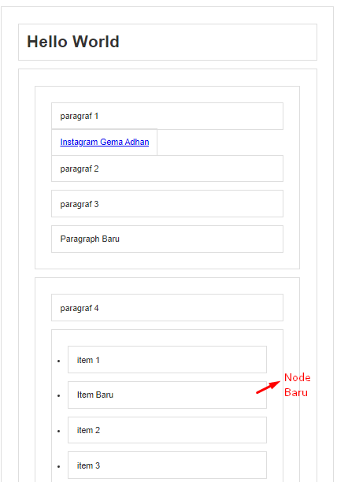

## DOM Manipulation 2

### Manipulasi Node
---
untuk menambahkan elemen baru, menghapus elemen, mengganti elemen dengan elemen yang baru. untuk melakukannya javascript memiliki beberapa method. 
- document.createElement()
- document.createTextNode()
- node.appendChild()
- node.insertBefore()
- parentNode.removeChild()
- parentNode.replaceChild()
- . . .

### Studi Kasus
---
di bawah adalah script html untuk studi kasus latihan
```html
<!DOCTYPE html>
<html lang="en">
<head>
  <meta charset="UTF-8">
  <title>Dom Selection</title>
  <style>
    * { 
        border: 2px solid #dedede; 
        padding: 15px; 
        margin: 15px; 
    }
    html { 
      margin: 0;
      padding: 0;
    }
    body { 
      max-width: 600px;
      margin: 30px auto;
      font-family: sans-serif;
      color: #333;
    }
  </style>
</head>
<body>

  <h1 id="judul">Hello World</h1>
  <div id="container">
      <section id="a">
          <p class="p1">paragraf 1</p>
          <a href="http://instagram.com/gemaadhan">Instagram Gema Adhan</a>
          <p class="p2">paragraf 2</p>
          <p class="p3">paragraf 3</p>
      </section>
      <section id="b">
          <p>paragraf 4</p>
          <ul>
              <li>item 1</li>
              <li>item 2</li>
              <li>item 3</li>
          </ul>
      </section>
  </div>

<script src="script.js"></script>
</body>
</html>
```


### Langkah Untuk Melakukan Manipulasi Node
---
1. buat dulu elemennya
2. buat isinya 
3. pindahkan isinya kedalam elemennya
4. simpan ke tempat yang kita mau

### Append Child
---
Sebagai contoh, kita akan menambahkan elemen baru ke dalam section dengan id a. 

```js
//buat tag p kosong
const pBaru = document.createElement("p");
//buat isinya
const teksPBaru = document.createTextNode("Paragraph Baru");
//pindahkan isi ke dalam tag p
pBaru.appendChild(teksPBaru);

//simpan pBaru di akhir Section A
const sectionA = document.getElementById("a");
sectionA.appendChild(pBaru);
```


### Insert Before
---
sebagai contoh, kita akan menambahkan node baru di dalam section dengan id b. kita akan menyisipkan node baru sebelum node yang sudah ada.
```js
//buat tag li kosong
const liBaru = document.createElement("li");
//buat isinya
const teksLiBaru = document.createTextNode("Item Baru");
//pindahkan isi ke dalam tag li
liBaru.appendChild(teksLiBaru);

//kita cari bungkus nya dulu
const ul = document.querySelector("section#b ul");

//kita perlu select li nomor 2 karena kita akan sisipkan elemen baru di bawahny
const li2 = ul.querySelector("li:nth-child(2)");

//didalam ul, sisipkan liBaru sebelum li2
ul.insertBefore(liBaru, li2);
```



