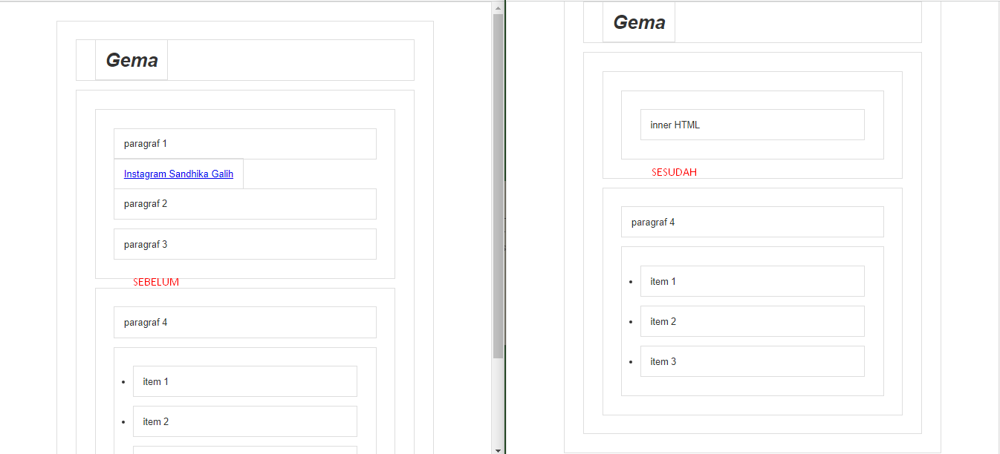

## DOM Manipulation

### Method untuk Manipulasi Elemen
- element.innerHTML
- element.style.<property>
- element.setAttribute()
- element.classList
- dan masih banyak lagi

### element.innerHTML
---
dengan innerHTML kita bisa menambahkan apapun ke dalam tag HTML yang kita seleksi, termasuk tag HTML lain. 

```js
const sectionA = document.querySelector("section#a");
sectionA.innerHTML = "Hallo Bro"
```



### element.style.propertiCSS
---
```js
const judul = document.querySelector("#judul");
judul.style.color = "lightblue";
// jika lebih dari satu kata, gunakan CamelCasing
judul.style.backgroundColor = "Salmon";
```

### Manipulasi Attribute
---

#### Menambahkan Attribute
```js
const judul = document.getElementsByTagName("h1")[0];
judul.setAttribute("name", "gema");
```

#### Mendapatkan Attribute
```js
const judul = document.getElementsByTagName("h1")[0];
const a = document.querySelector("section#a a");
a.getAttribute("href");
//http://instagram.com/gemaadhan
judul.getAttribute("id");
//judul
```

#### Menghapus Attribute
```js
a.removeAttribute("href");
//null
```
#### Mengganti Isi Class
dengan setAttribute kita bisa mengganti isi kelas
```js
const p2 = document.querySelectorAll("section#a p")[1];
p2.setAttribute("class", "bukanp2");
//makan isi class akan bergantidari p2 menjadi bukanp2
```

### Mengelola Class
---
dengan setAttribute kita hanya bisa mengganti isi Class, tidak bisa menambahkan Class dimana biasanya sebuah elemen memiliki beberapa Class. hal ini bisa dilakukan dengan classList.
dengan classList kita bisa memanipulasi kelas lebih leluasa. ada beberapa method pada classlist
1. element.classList.add(), untuk menambahkan kelas baru
2. element.classList.remove(), untuk menghapus kelas yang dipilih
3. element.classList.toggle(), jika elemen tersebut belum punya class yang dimaksud, toggle akan menambahkan class tersebut, namun jika elemen sudah punya class yang dimaksud, maka toggle akan menghilangkan class tersebut.
4. element.classList.item(), misalkan sebuah elemen memiliki 3 kelas, kita pengen tau kelas ke 3 nya apa 
5. element.classList.contains(), dengan ini kita mengecek apakah sebuah elemen memiliki kelas tertentu
6. element.classList.replace(), untuk mengganti class yang ada dengan class yang baru. 

##### classList
```js
const p2 = document.querySelector(".p2");
p2.classList;
//maka akan menghasilkan elemen apa saja yang ada dalam elemen 
//DOMTokenList ['p2', value: 'p2']
```

##### Menambahkan Kelas
```js
const p2 = document.querySelector(".p2");
p2.classList.add("paragraph");
//maka akan menambahkan kelas paragraph ke elemen
//<p class="p2 paragraph">paragraf 2</p>
```

##### Toggle
```js
p2.classList.toggle("lampu");
//<p class="p2 paragraph lampu">paragraf 2</p>
p2.classList.toggle("lampu");
//<p class="p2 paragraph">paragraf 2</p>
```

##### Item
```js
const p2 = document.querySelector(".p2");
p2.classList.add("satu");
p2.classList.add("dua");
p2.classList.add("tiga");
p2.classList.add("empat");
p2.classList.item("2");
//dua
```

##### contains
```js
p2.classList.contains("tiga")
//true
```

##### replace
```js
p2.classList.replace("tiga","telu")
//true
//<p class="p2 satu dua telu empat">paragraf 2</p>
```