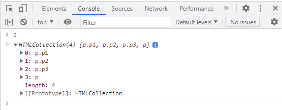
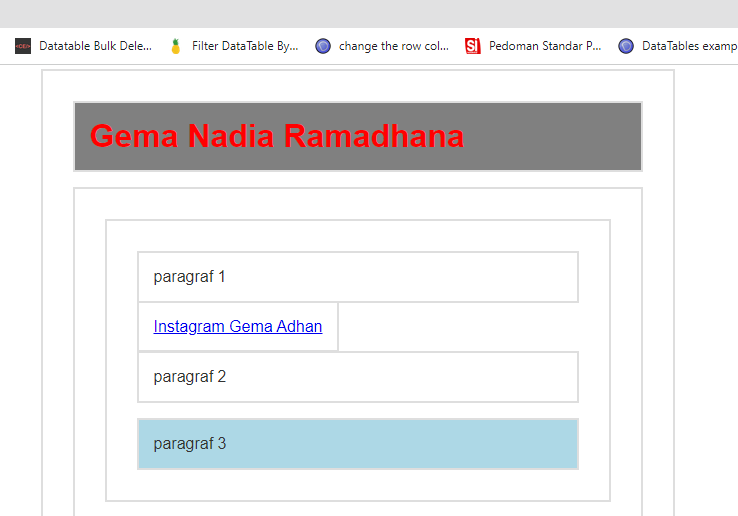
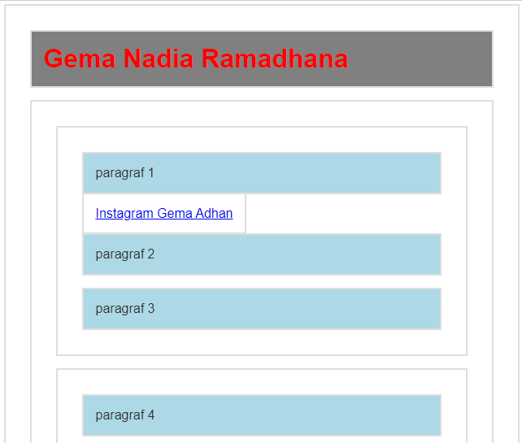
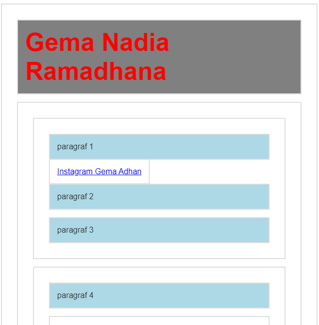
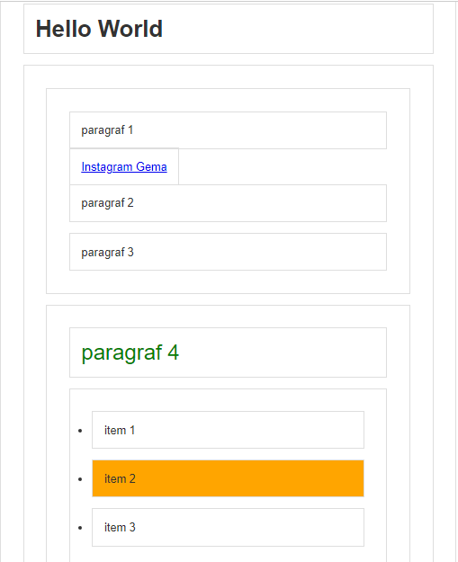
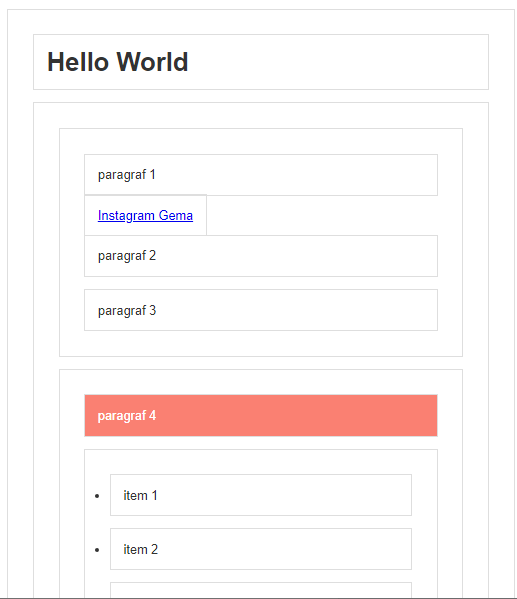

## DOM Selection

### DOM Selection Method
1. **getElementById()** method untuk memilih elemen di dalam DOM berdasarkan Id, dalam satu dokumen hanya boleh ada satu elemen yang memiliki Id tertentu. 
2. **getElementsByTagName()** untuk mencari elemen elemen dengan nama Tag tertentu. 
3. **getElementsByClassName()** untuk mencari elemen elemen dengan class tertentu
4. **querySelector() dan querySelectorAll()** penggunaan nya mirip seperti menggunakan selector pada CSS

### Return value
masing masing method tadi punya kembalian berbeda
| Method | Hasil |
|-|-|
|getElementById()|element|
|getElementsByTagName()|HTMLCollection|
|getElementsByClassName()|HTMLCollection|
|querySelector()|element|
|querySelectorAll()|nodeList|

### Contoh Pemakaian Method

#### getElementById()
method getElementById() akan mengembalikan sebuah **elemen**

```js
const judul = document.getElementById("judul");
```


>selalu tempatkan script.js dibawah sebelum tutup body. 

kita dapat menambahkan inline css memanfaatkan getElementById().

```js
const judul = document.getElementById("judul");
judul.style.color = "red";
judul.style.backgroundColor = "grey";
judul.innerHTML = "Gema Nadia Ramadhana";
```


#### getElementsByTagName()
metho getElementsByTagName() akan mengembalikan HTMLCollection yang kalo kita perhatikan dikembalian ada kurung siku yang mirip array


karena yang dikembalikan adalah array (HTMLCollection), kita tidak bisa langsung memanipulasi variabel p. karena p merupakan array. 

```js
const p = document.getElementsByTagName("p");
p.style.backgroundColor = "lightblue";
```


sehingga kita perlu tambahkan indexnya, sesuaikan dengan letak elemen yang mau kita pilih

```js
const p = document.getElementsByTagName("p");
// p.style.backgroundColor = "lightblue";
p[2].style.backgroundColor = "lightblue";
```



untuk menyeleksi seluruh elemen di dalam HTMLCollection kita bisa gunakan looping

```js
for (let i = 0; i < p.length; i++) {
  p[i].style.backgroundColor = "lightblue";
}
```



getElementsByTagName() akan selalu mengembalikan HTMLCollection(array), maka jika anggota array nya cuma 1 pun, kita tetap harus mengaksesnya dengan indeks.

```js
const h1 = document.getElementsByTagName("h1");
```


kita bisa gunakan penulisan indeksnya di belakang kayak gini
```js
const h1 = document.getElementsByTagName("h1")[0];
h1.style.fontSize = "50";
```



#### getElementsByClassName()
ini juga mengembalikan HTMLCollection

```js
const p1 = document.getElementsByClassName("p1");
p1[0].innerHTML = "ini diubah menggunakan getElementByClassName";
```


#### querySelector() 
---
kembaliannya adalah elemen
```js
const p4 = document.querySelector("#b p");
```


```js
const p4 = document.querySelector("#b p");
p4.style.color = "green";
p4.style.fontSize = "30px";

const li2 = document.querySelector("#b ul li:nth-child(2)");
li2.style.backgroundColor = "orange";
```



karena hanya menghasilkan sebuah elemen, kode seperti berikut hanya akan men target elemen pertamanya saja jika memang elemen nya ada banyak.

```js
const p = document.querySelector("p");
p.innerHTML = "ini diubah melalui javascript";
```


#### querySelectorAll()
---
akan mengembalikan nodeList

```js
const p = document.querySelectorAll("p");
```


```js
const p = document.querySelectorAll("p");

for (let i = 0; i < p.length; i++) {
  p[i].style.backgroundColor = "lightblue";
}
```


### Bagaimana Memilih Selector ?

- kalau elemen nya punya Id gunakan getElementById();
- kalau elemennya punya class gunakan getElementsByClassName()
- kalau tidak boleh merubah struktur html(seperti nambahin id / class), gunakan querySelector() atau querySelectorAll()
- dari sisi performance, method tercepat adalah getElementById() dan getElementsByTagName()

### Mengubah Node Root
```js
const sectionb = document.getElementById("b");
const p = sectionb.querySelector("p");
p.style.backgroundColor = "salmon";
p.style.color = "white";
```


