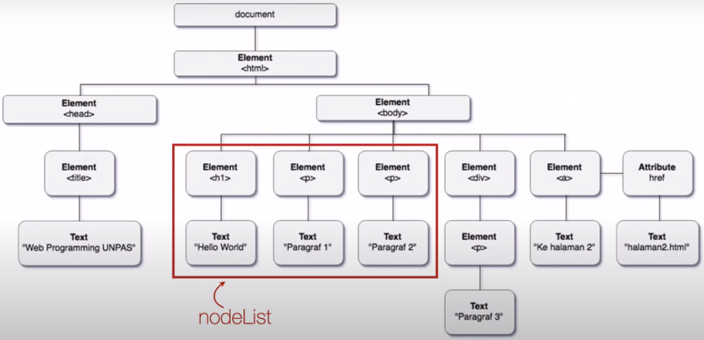

## DOM TREE

### Tipe Tipe Node 
- **Elemen**
- Attribute
- **Text**
- CData Section
- Entity Reference
- Entity
- Processing Instruction
- Comment
- **Document**
- Document Type
- Document Fragment
- Notation

tiap tiap node pada DOM Tree punya tipe yang berbeda, yaitu Elemen, Text, Document, dan banyak lainnya.

### NodeList & HTMLCollection

salah satu simpul di bawah... yang manapun... itu kita sebut sebagai node. 

jika kita memilih lebih dari satu node, itu kita sebut dengan nodelist, tidak peduli tipe node nya apa.

sedangkan HTMLCollection adalah kumpulan node khusus yang tipenya element HTML saja

- Keduanya merupakan kumpulan node
- Strukturnya mirip array
- **nodeList** dapat berisi node apapun, sedangkan **HTMLCollection** harus berisi elemen HTML
-  **HTMLCollection** bersifat *live* sedangkan **nodeList** tidak

### Struktur Hirarki DOM Tree
- Root Node : merupakan node yang menjadi sumber dari semua node lain di dalam DOM, yang secara default adalah document.
- Parent Node : node yang berada 1 tingkat di atas node yang lain. contohnya body adalah parent dari p,h1,ul. 
  - grandparent : node yang berada 2 tingkat di atas node yang lain
  - Ancestor : node yang berada lebih dari 2 tingkat di atas node yang lain.
- Child Node : node yang berada 1 tingkat dibawah node yang lain. contohnya h1 adalah child dari body. 
  - children : child node yang bertipe elemen html . 
  - sibling : child node yang memiliki parent yang sama 
  - descendants : child node nya child