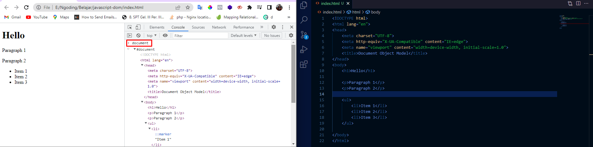

## Pendahuluan
### Apa itu DOM ?
>DOM adalah antarmuka pemograman untuk HTML yang merepresentasikan halaman web, sehingga program dapat menghubah dan memanipulasi struktur nya.  *-Mozilla-*

>Representasi elemen HTML pada dokumen menjadi sebuah object. *-SG-*

### DOM Tree
DOM tersimpan di dalam memory sebagai pohon hirarki DOM. 

tiap tiap kotak nya disebut sebagai simpul/node, dan semuanya berada di dalam sebuah simpul yaitu document. 

>document adalah salah satu object yang ada di dalam object window. yang bisa mengontrol browser. 

### DOM
- Antarmuka pemograman berbasis objek yang merepresentasikan dokumen web
- DOM membuat seluruh komponen dari halaman web dapat diakses dan dimanipulasi
- komponen
  - Elemen HTML
  - Attribut
  - Text
  - Dll
- DOM dapat dimanipulasi(dibuat,diubah,dihapus) menggunakan javascript. 