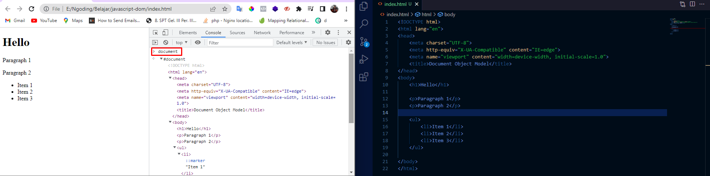
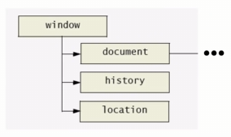

# **JAVASCRIPT-DOM**

## Pendahuluan
### Apa itu DOM ?
DOM adalah antarmuka pemograman untuk HTML yang merepresentasikan halaman web, sehingga program dapat menghubah dan memanipulasi struktur nya.  *-Mozilla-*

Representasi elemen HTML pada dokumen menjadi sebuah object. *-SG-*

### DOM Tree
DOM tersimpan di dalam memory sebagai pohon hirarki DOM. 

tiap tiap kotak nya disebut sebagai simpul/node, dan semuanya berada di dalam sebuah simpul yaitu document. 

>document adalah object yang ada di dalam object window. yang bisa mengontrol browser. 

### DOM
- Antarmuka pemograman berbasis objek yang merepresentasikan dokumen web
- DOM membuat seluruh komponen dari halaman web dapat diakses dan dimanipulasi
- komponen
  - Elemen HTML
  - Attribut
  - Text
  - Dll
- DOM dapat dimanipulasi(dibuat,diubah,dihapus) menggunakan javascript. 

## DOM TREE
tiap tiap node pada DOM Tree punya tipe yang berbeda, yaitu Elemen, Text, Document, dan banyak lainnya.

### NodeList & HTMLCOllection
- Keduanya merupakan kumpulan node
- Strukturnya mirip array
- **nodeList** dapat berisi node apapun, sedangkan **HTMLCollection** harus berisi elemen HTML
-  **HTMLCollection** bersifat *live* sedangkan **nodeList** tidak

### Struktur Hirarki DOM Tree
- Root Node : merupakan node yang menjadi sumber dari semua node lain di dalam DOM, yang secara default adalah document.
- Parent Node : node yang berada 1 tingkat di atas node yang lain. contohnya body adalah parent dari p,h1,ul. 
  - grandparent : node yang berada 2 tingkat di atas node yang lain
  - Ancestor : node yang berada lebih dari 2 tingkat di atas node yang lain.
- Child Node : node yang berada 1 tingkat dibawah node yang lain. contohnya h1 adalah child dari body. 
  - children : child node yang bertipe elemen html . 
  - sibling : child node yang memiliki parent yang sama 
  - descendants : child node nya child