# **JAVASCRIPT-DOM**

## Pendahuluan
### Apa itu DOM ?
DOM adalah antarmuka pemograman untuk HTML yang merepresentasikan halaman web, sehingga program dapat menghubah dan memanipulasi struktur nya.  *-Mozilla-*

Representasi elemen HTML pada dokumen menjadi sebuah object. *-SG-*


### DOM Tree
DOM tersimpan di dalam memory sebagai pohon hirarki DOM. 


tiap tiap kotak nya disebut sebagai simpul/node, dan semuanya berada di dalam sebuah simpul yaitu document. 

>document adalah object yang ada di dalam object window. yang bisa mengontrol browser. 


### DOM
- Antarmuka pemograman berbasis objek yang merepresentasikan dokumen web
- DOM membuat seluruh komponen dari halaman web dapat diakses dan dimanipulasi
- komponen
  - Elemen HTML
  - Attribut
  - Text
  - Dll
- DOM dapat dimanipulasi(dibuat,diubah,dihapus) menggunakan javascript. 

## DOM TREE

### Tipe Tipe Node 
- **Elemen**
- Attribute
- **Text**
- CData Section
- Entity Reference
- Entity
- Processing Instruction
- Comment
- **Document**
- Document Type
- Document Fragment
- Notation

tiap tiap node pada DOM Tree punya tipe yang berbeda, yaitu Elemen, Text, Document, dan banyak lainnya.


### NodeList & HTMLCollection
salah satu simpul di bawah... yang manapun... itu kita sebut sebagai node. 

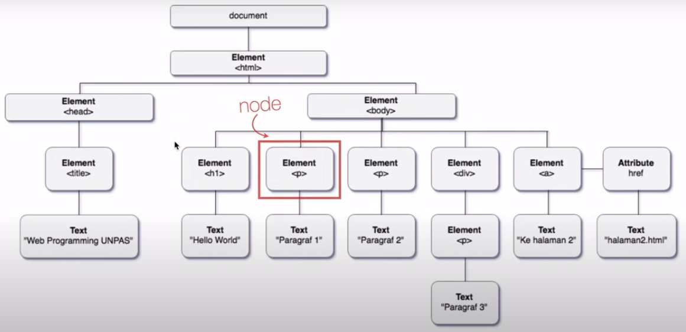

jika kita memilih lebih dari satu node, itu kita sebut dengan nodelist, tidak peduli tipe node nya apa.

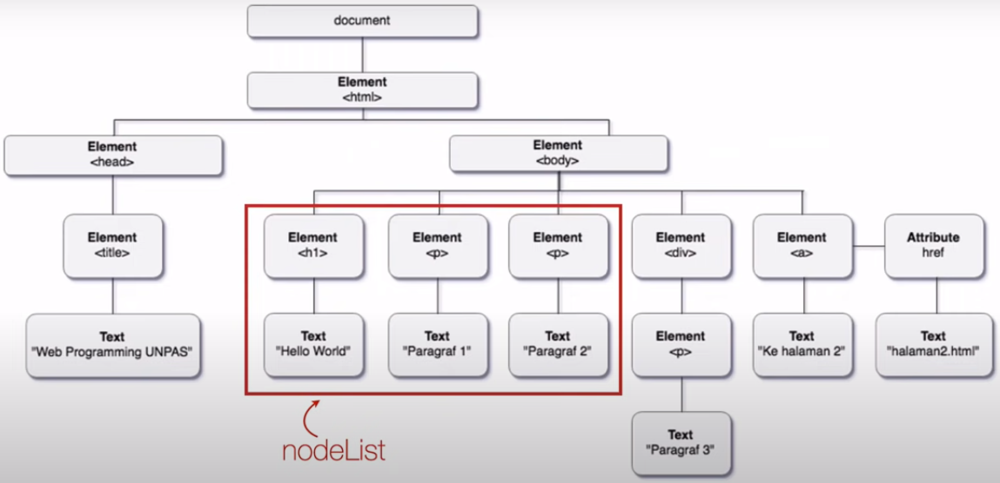

sedangkan HTMLCollection adalah kumpulan node khusus yang tipenya element HTML saja

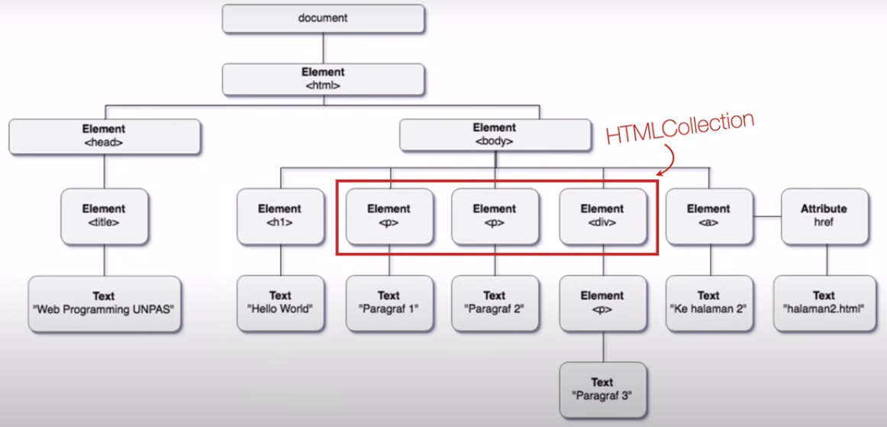

- Keduanya merupakan kumpulan node
- Strukturnya mirip array
- **nodeList** dapat berisi node apapun, sedangkan **HTMLCollection** harus berisi elemen HTML
-  **HTMLCollection** bersifat *live* sedangkan **nodeList** tidak

### Struktur Hirarki DOM Tree
- Root Node : merupakan node yang menjadi sumber dari semua node lain di dalam DOM, yang secara default adalah document.
- Parent Node : node yang berada 1 tingkat di atas node yang lain. contohnya body adalah parent dari p,h1,ul. 
  - grandparent : node yang berada 2 tingkat di atas node yang lain
  - Ancestor : node yang berada lebih dari 2 tingkat di atas node yang lain.
- Child Node : node yang berada 1 tingkat dibawah node yang lain. contohnya h1 adalah child dari body. 
  - children : child node yang bertipe elemen html . 
  - sibling : child node yang memiliki parent yang sama 
  - descendants : child node nya child

## DOM Selection

### DOM Selection Method
1. **getElementById()** method untuk memilih elemen di dalam DOM berdasarkan Id, dalam satu dokumen hanya boleh ada satu elemen yang memiliki Id tertentu. 
2. **getElementsByTagName()** untuk mencari elemen elemen dengan nama Tag tertentu. 
3. **getElementsByClassName()** untuk mencari elemen elemen dengan class tertentu
4. **querySelector() dan querySelectorAll()** penggunaan nya mirip seperti menggunakan selector pada CSS

### Return value
masing masing method tadi punya kembalian berbeda
| Method | Hasil |
|-|-|
|getElementById()|element|
|getElementsByTagName()|HTMLCollection|
|getElementsByClassName()|HTMLCollection|
|querySelector()|element|
|querySelectorAll()|nodeList|

### Contoh Pemakaian Method

#### getElementById()
method getElementById() akan mengembalikan sebuah **elemen**

```js
const judul = document.getElementById("judul");
```

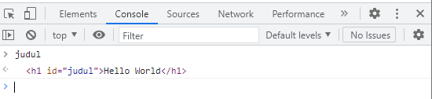

>selalu tempatkan script.js dibawah sebelum tutup body. 

kita dapat menambahkan inline css memanfaatkan getElementById().

```js
const judul = document.getElementById("judul");
judul.style.color = "red";
judul.style.backgroundColor = "grey";
judul.innerHTML = "Gema Nadia Ramadhana";
```

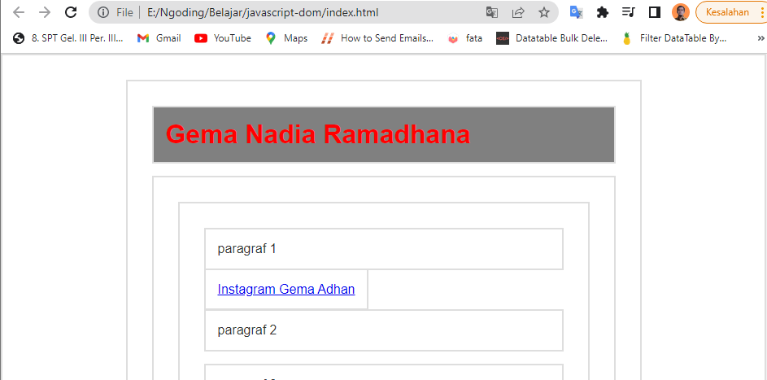

#### getElementsByTagName()
metho getElementsByTagName() akan mengembalikan HTMLCollection yang kalo kita perhatikan dikembalian ada kurung siku yang mirip array
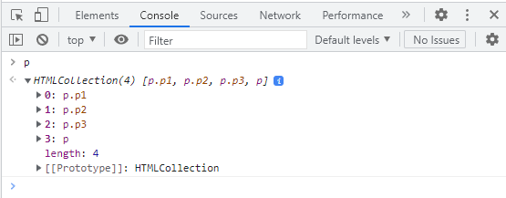

karena yang dikembalikan adalah array (HTMLCollection), kita tidak bisa langsung memanipulasi variabel p. karena p merupakan array. 

```js
const p = document.getElementsByTagName("p");
p.style.backgroundColor = "lightblue";
```

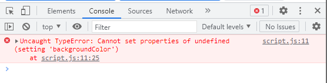

sehingga kita perlu tambahkan indexnya, sesuaikan dengan letak elemen yang mau kita pilih

```js
const p = document.getElementsByTagName("p");
// p.style.backgroundColor = "lightblue";
p[2].style.backgroundColor = "lightblue";
```

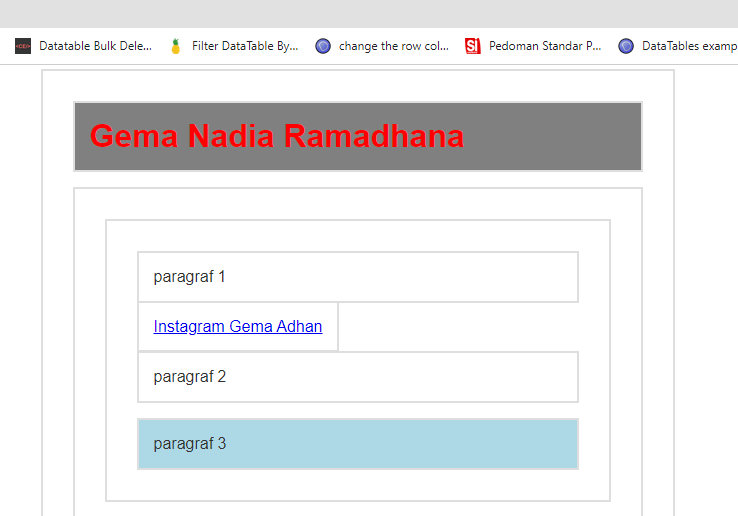

untuk menyeleksi seluruh elemen di dalam HTMLCollection kita bisa gunakan looping

```js
for (let i = 0; i < p.length; i++) {
  p[i].style.backgroundColor = "lightblue";
}
```

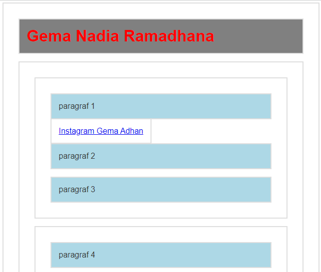

getElementsByTagName() akan selalu mengembalikan HTMLCollection(array), maka jika anggota array nya cuma 1 pun, kita tetap harus mengaksesnya dengan indeks.

```js
const h1 = document.getElementsByTagName("h1");
```

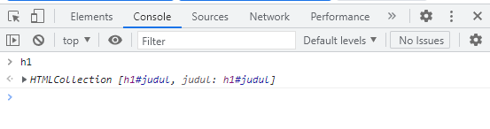

kita bisa gunakan penulisan indeksnya di belakang kayak gini
```js
const h1 = document.getElementsByTagName("h1")[0];
h1.style.fontSize = "50";
```

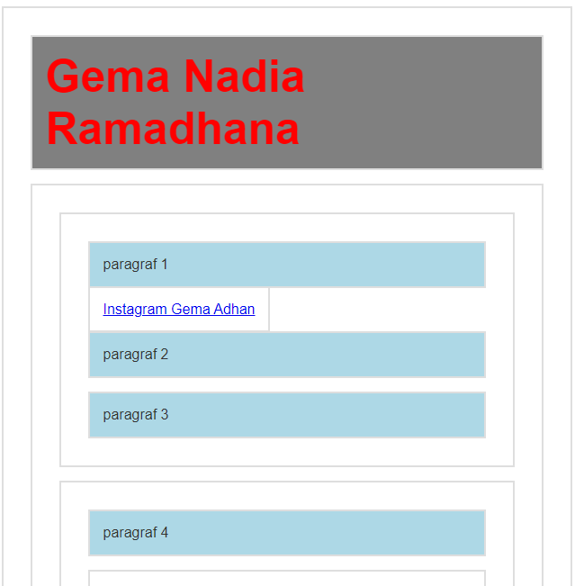

#### getElementsByClassName()
ini juga mengembalikan HTMLCollection

```js
const p1 = document.getElementsByClassName("p1");
p1[0].innerHTML = "ini diubah menggunakan getElementByClassName";
```

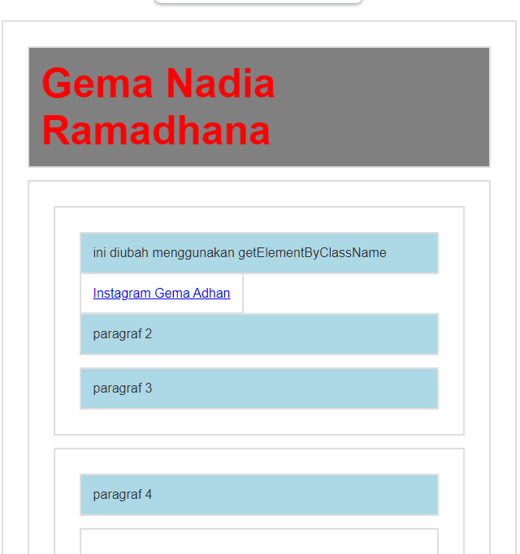

#### querySelector() 
---
kembaliannya adalah elemen
```js
const p4 = document.querySelector("#b p");
```

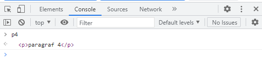

```js
const p4 = document.querySelector("#b p");
p4.style.color = "green";
p4.style.fontSize = "30px";

const li2 = document.querySelector("#b ul li:nth-child(2)");
li2.style.backgroundColor = "orange";
```

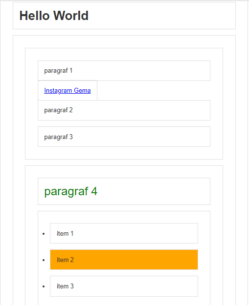

karena hanya menghasilkan sebuah elemen, kode seperti berikut hanya akan men target elemen pertamanya saja jika memang elemen nya ada banyak.

```js
const p = document.querySelector("p");
p.innerHTML = "ini diubah melalui javascript";
```

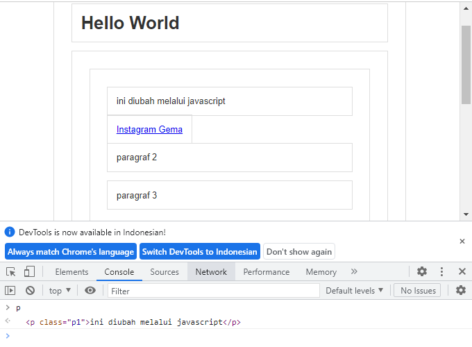

#### querySelectorAll()
---
akan mengembalikan nodeList

```js
const p = document.querySelectorAll("p");
```

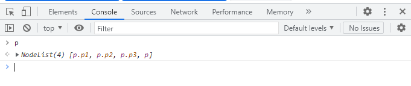

```js
const p = document.querySelectorAll("p");

for (let i = 0; i < p.length; i++) {
  p[i].style.backgroundColor = "lightblue";
}
```

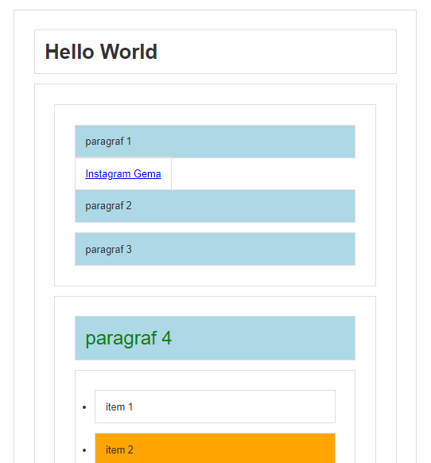

### Bagaimana Memilih Selector ?

- kalau elemen nya punya Id gunakan getElementById();
- kalau elemennya punya class gunakan getElementsByClassName()
- kalau tidak boleh merubah struktur html(seperti nambahin id / class), gunakan querySelector() atau querySelectorAll()
- dari sisi performance, method tercepat adalah getElementById() dan getElementsByTagName()

### Mengubah Node Root
```js
const sectionb = document.getElementById("b");
const p = sectionb.querySelector("p");
p.style.backgroundColor = "salmon";
p.style.color = "white";
```

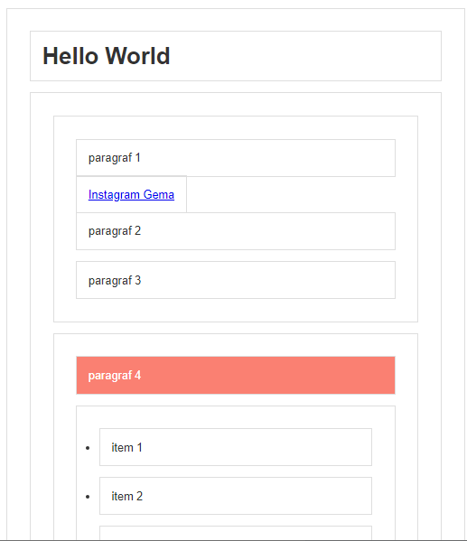